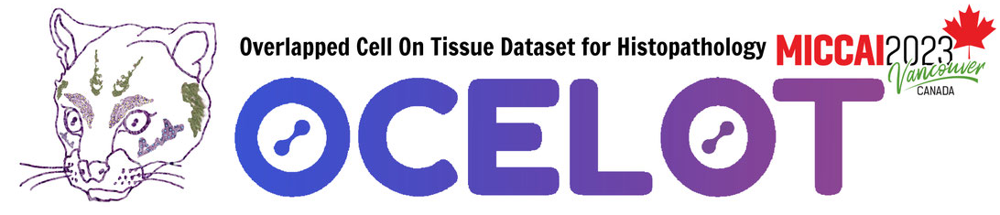
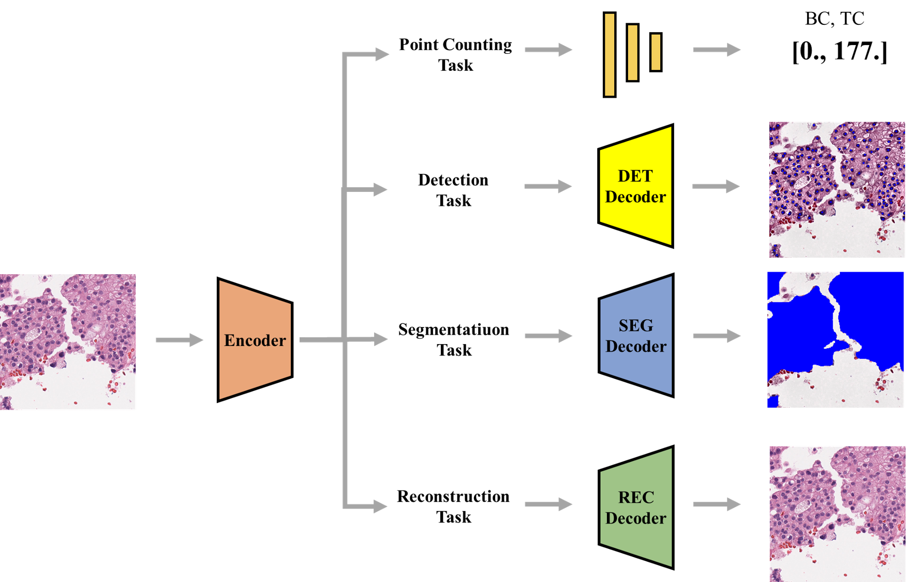

 

# MICCAI2023_OCELOT

* [MI2RL](https://www.mi2rl.co/)@Asan Medical Center, South Korea, Professor :  Namkug Kim

* **Manager**
  * [경성구](https://github.com/babbu3682)

Here is my solution

 

This repository is for participating in OCELOT 2023 challenge. 

For more information, please refer to the following. https://ocelot2023.grand-challenge.org/